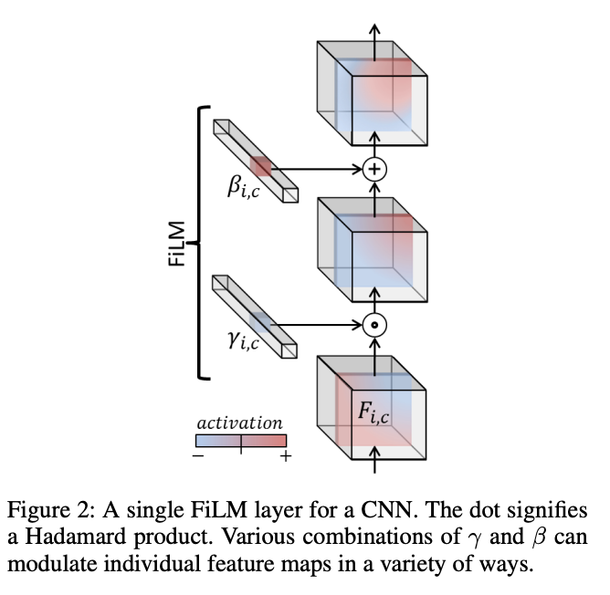

[s1]：欢迎大家收听本期论文解读,今天分享的是2023 年发表的《Diffusion Policy: Visuomotor Policy Learning via Action Diffusion》。让我们从头开始。灵感与团队：主要灵感来源于扩散模型在图像生成领域的成功应用（例如 DDPM 和稳定扩散）。作者意识到，同样的技术——通过迭代将噪声去噪为连贯数据——在生成机器人动作方面也极其强大，尤其是在机器人策略通常需要处理多模态行为和高维动作序列的情况下。这篇论文背后的团队实力雄厚：Cheng Chi1, Siyuan Feng2, Yilun Du3, Zhenjia Xu1, Eric Cousineau2, Benjamin Burchfiel2, Shuran Song1。这是哥伦比亚大学、丰田研究院和麻省理工学院之间的合作项目。

[s2]：本文有哪些方面实现了重大飞跃？

[s1]：关键改进 最大的创新在于将机器人策略本身表示为一个条件去噪扩散过程。该策略不再直接预测动作，而是根据视觉观察结果，迭代地将噪声细化为逼真的动作序列。这带来了三大优势：对多模态动作分布的出色建模对高维动作序列的自然支持,与之前的隐式模型（如IBC）相比，训练过程非常稳定。他们还引入了带有动作块、视觉条件反射和新的时间序列扩散转换器的地平线后退控制。

[s2]：他们使用了哪些数据集？

[s1]：数据集和评估 他们在 4 个主要基准测试中评估了 12 项任务：RoboMimic（Lift、Can、Square、Transport、ToolHang）Push-T（仿真+真实机器人）其他现实世界的操作任务,他们同时采用了基于状态和基于图像的观测数据，并结合了人工远程操作演示（熟练程度不一）。论文显示，该方法相比以往最先进的方法平均提升了46.9%。在几乎所有任务中，扩散策略的性能都始终优于LSTM-GMM、IBC和BET。

[s2]：现在我们来谈谈技术细节。你能解释一下输入/输出和观测范围吗？[s1]：输入/输出格式：在每个时间步 t：输入：最新的 T_o 个观测值（观测范围）。对于视觉应用，这通常是由 ResNet-18 编码器处理后的最近 2 帧 RGB 图像。
输出：一系列 T_p 个未来动作（预测范围）。机器人仅执行前 T_a 个动作（动作执行范围），然后重新规划。
典型值：T_o=2，T_p=16，T_a=8。这既保证了时间一致性，又保持了响应速度。扩散过程将整个动作序列（T_p，动作维度）视为去噪对象——类似于图像去噪的方式，但使用的是一维运算。

[s2]：扩散回路在这里是如何运作的？

[s1]：扩散过程是一个外循环：从纯高斯噪声作为动作序列开始。
对于 K 步（例如 100 次训练，10 次推理，使用 DDIM）：将带噪声的动作 + 观测 + 当前时间步 k 输入到网络中。
网络预测噪声。
对动作序列进行轻微降噪处理。
完成所有步骤后，您将得到一个干净、流畅的动作块。
这与直接产生单一行动的传统政策完全不同。

[s2]：这两种网络架构有什么区别？

[s1]：架构 1 – 基于 CNN 的（1D U-Net）使用 1D 时间 U-Net 骨干网络。
在每个块中，通过 FiLM（特征线性调制）注入观测值和时间步长。
FiLM 通过预测每个通道的尺度 (γ) 和偏置 (β) 来调节特征。它对卷积神经网络高效有效。

架构 2 – 时间序列扩散转换器动作变成令牌。
时间步嵌入已添加至前缀。
观测数据经过 MLP 处理，并使用交叉注意力机制。
更擅长捕捉急剧、高频的动作变化，但对超参数更敏感。
两者都接受相同的输入（噪声动作序列+观察条件），并输出预测噪声。

[s2]：作者对未来的工作有什么建议吗？

[s1]：未来工作 作者建议：扩大模型规模，并纳入更多数据
提高实时控制推理速度的更佳方法
将扩散策略与强化学习或在线微调相结合
扩展到更复杂的长时程任务和多机器人场景
提高Transformer版本的训练稳定性
他们希望这能激发新一代生成式政策学习方法。

[s2]：这真的很有帮助。还有什么要补充的吗？

[s1]：扩散策略表明，在扩散模型中将机器人动作视为图像处理，其效果出乎意料地强大。强大的生成模型、时间分块和有效的视觉条件反射相结合，使其成为视觉运动策略学习领域的一项里程碑式工作。感谢观看！

