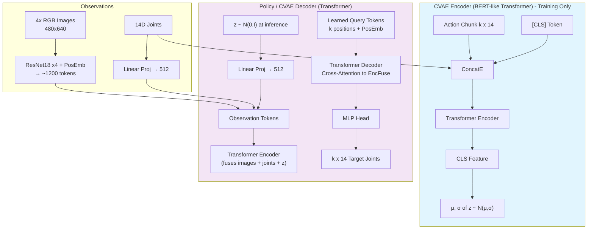
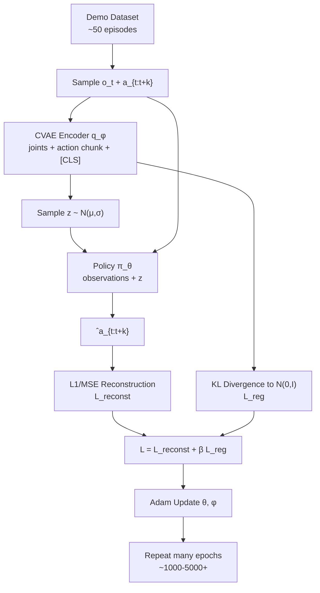
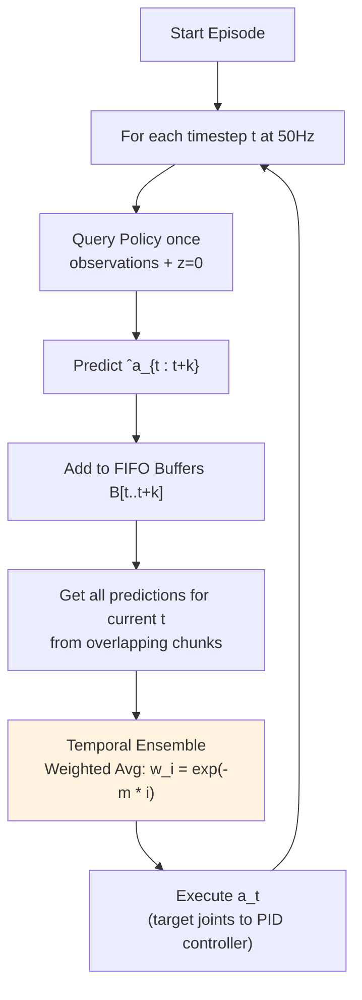

**ACT (Action Chunking with Transformers)** 是一种生成式模仿学习算法，源自 2023 年 RSS 会议论文《Learning Fine-Grained Bimanual Manipulation with Low-Cost Hardware》（即 ALOHA 项目）。该算法使低成本机器人硬件能够执行精确、涉及频繁接触且需闭环控制的双臂操作任务（例如：打开半透明调料杯、安装电池、穿扎带），且仅需约 50 次简短的人类演示（约 10 分钟的数据）即可实现。

### 核心灵感
标准的行为克隆（即单步动作预测）在长时程、高精度任务中容易出现**误差累积（compounding errors）**问题：微小的预测偏差会导致机器人偏离训练数据分布，从而难以恢复正常轨迹。此外，人类演示具有多模态/随机性特征（即达成同一目标有多种方式，且存在停顿等时间上的变化）。

ACT 借鉴了以下概念：
- **动作分块（Action chunking）**（源自神经科学/心理学）：将动作组合成“块（chunk）”作为整体执行。这缩短了*有效预测时程*（一次预测 $k$ 个未来动作而非单个动作），从而减轻误差累积，并能处理分块内部的非马尔可夫或具有时间相关性的行为（如停顿）。
- **Transformer** 架构：用于序列建模（擅长融合多视角观测信息并生成连贯的动作序列）。
- **条件变分自编码器（CVAE）**：将人类数据中的多模态特性建模为一个生成过程。

### 网络架构
ACT 训练为**条件变分自编码器（CVAE）**，包含编码器（仅在训练时使用，推理时丢弃）和解码器（即策略网络）。

- **观测数据（每个时间步）**：4 幅 RGB 图像（分辨率 480x640，来自前视、顶视及两个腕部摄像头）+ 14 维关节位置（每臂 7 维，对应从动机器人/follower robots）。
- **动作数据**：14 维绝对目标关节位置（记录自遥操作期间的主动臂/leader joints，因为这些位置隐式编码了通过从动臂 PID 控制产生的力信息）。
- **图像处理**：每个摄像头对应一个 ResNet18 → 特征图 → 展平（flatten）+ 二维正弦位置编码 → 约 1200 个维度为 512 的 token。随后拼接投影后的关节位置和风格变量 $z$。 - **CVAE 编码器**（类 BERT 的 Transformer 编码器）：输入包括当前关节状态、完整的动作片段（长度为 k）以及 [CLS] 标记。[CLS] 标记的输出用于预测潜在风格变量 z（服从对角高斯分布）的均值和方差。为提高速度，此处省略了图像输入（仅使用本体感知数据和动作数据）。
- **解码器/策略网络**（采用交叉注意力机制的 Transformer，灵感源自 DETR）：基于当前观测信息（图像、关节状态及 z）进行条件生成。利用 Transformer 编码器融合信息，随后通过解码器（针对 k 个输出位置使用固定位置编码，并对编码器输出执行交叉注意力操作）以自回归或直接方式预测长度为 k × 14 的动作片段。最后接一个 MLP 输出头。参数量约为 8000 万。

**为何选择类 BERT（编码器架构）而非类 GPT（仅解码器的自回归架构）？** 编码器能够高效地双向处理完整的动作片段与观测信息，从而生成 CVAE 的潜在变量 z。解码器端则利用交叉注意力机制，基于条件信息生成动作片段。这种架构非常适合动作数据的分段预测模式（即非逐 token 自回归预测），与语言模型中的“预测下一个 token”任务有所不同。

**CVAE 编码器建模（条件化机制）**：编码器 q_φ(z | a_{t:t+k}, ō_t) 以*动作片段*和本体感知数据（ō_t = 关节状态，不含图像）为条件，推断出潜在的“风格”变量 z，该变量解释了人类执行该动作片段时表现出的变异性。在训练过程中，会对 z 进行采样。解码器则结合 z 与完整观测信息来重构或预测动作片段。在推理阶段，将 z 设为 0（即先验分布均值）以获得确定性输出。通过 KL 正则化（加权系数为 β）约束 z，使其分布接近标准正态分布 N(0, I)。

### 算法 1：ACT 训练过程
1. 从演示数据集 D 中采样观测数据 o_t 和动作片段 a_{t:t+k}。
2. 采样 z ~ q_φ(z | a_{t:t+k}, ō_t) [编码器，省略图像输入]。
3. 预测 ˆa_{t:t+k} ~ π_θ(· | o_t, z) [解码器/策略网络]。 4. 重建损失：L_reconst = L1/MSE(ˆa, a) [论文中使用 L1 以保证精度]。
5. 正则化项：L_reg = D_KL(q_φ(z|...) || N(0,I))。
6. 总损失：L = L_reconst + β L_reg。使用 Adam 优化器更新编码器/解码器。

针对每个任务从头开始训练（例如，1000–5000+ 个 epoch；即使损失值已趋于平稳，更长时间的训练也能改善运动的平滑度）。分段长度 k=100（常用值），β=10。

### 算法 2：ACT 推理（结合时间集成/Temporal Ensembling）
- 针对未来的每个时间步，维护用于存储预测动作的 FIFO（先进先出）缓冲区。
- 在每个时间步 t（50Hz 频率）：
- 查询一次策略：在 z=0 的条件下预测动作片段 ˆa_{t:t+k}。 
- 将预测结果添加到相应的未来缓冲区 B[t : t+k] 中。 
- 针对当前动作 a_t：计算缓冲区中针对时间步 t 的所有预测结果的加权平均值。权重 w_i = exp(-m * i)（指数衰减，赋予近期预测更高的权重；m 控制新观测值被纳入计算的速度）。
- 执行 a_t（将目标关节指令发送至底层 PID 控制器）。

**时间集成具体示例**：假设 k=4，m 经调整后，针对特定时间步 t 的重叠预测结果，权重约为 [0.5, 0.3, 0.2, 0.1]。与其开环执行原始动作片段 k 个步骤（这会导致动作生硬、反应迟钝），不如频繁查询并融合重叠的片段预测结果，从而实现平滑且响应迅速的控制。这避免了……
