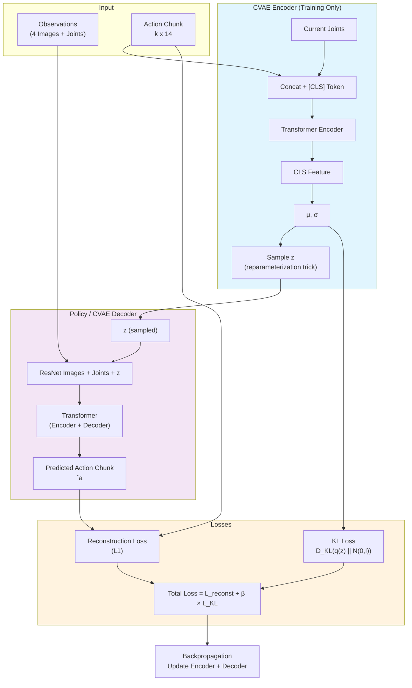
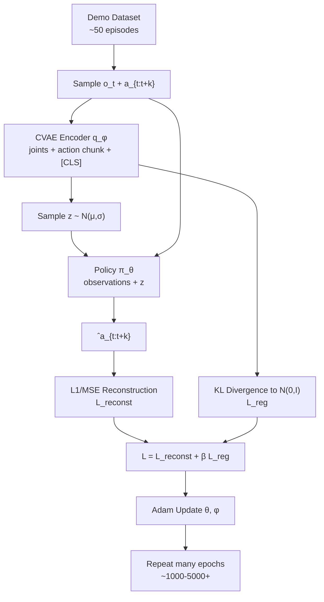
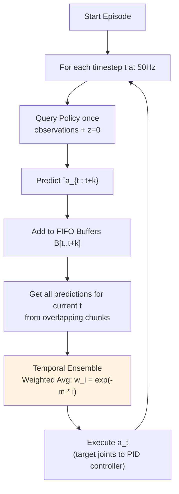

[s1]: 大家好，今天我们将完整、深入地讲解 **ACT（Action Chunking with Transformers）** 算法，来自 ALOHA 项目。我们不仅会讲原理、架构、CVAE，还会详细对比 AE/VAE/CVAE，剖析时间集成的具体例子，最后直面它的真实局限性。

[s2]: 我已经看过一些资料，但很多细节还是模糊。今天希望你能讲得透彻一些，尤其是 CVAE 和实际训练中的问题。

---

[s1]: 好的，我们从整体开始。**ACT 是什么？它的核心灵感在哪里？**

[s1]: ACT 是一种生成式模仿学习算法，仅用约 50 次演示（10 分钟数据）就能让低成本双臂机器人完成高精度任务，比如打开半透明调料杯、插电池等。它主要解决传统行为克隆的**误差累积**问题，同时处理人类演示的多模态特性。

[s2]: 具体是怎么解决的？

[s1]: 通过三个关键技术：动作分块、Transformer 架构，以及条件变分自编码器 CVAE。我们先来看网络架构。

[s2]: 这个架构里，CVAE 到底在做什么？能从零开始详细解释一下吗？另外 AE、VAE、CVAE 到底有什么区别？

[s1]: 很好，我们来深入对比一下。

**AE（Autoencoder）**：最简单，只有 Encoder 把输入 x 压缩成固定 latent z，Decoder 重建。损失只有重建误差。Latent 是确定性的点，没有概率分布。缺点是 latent 空间可能不连续、不光滑，无法很好生成新样本。

**VAE（Variational Autoencoder）**：在 AE 基础上引入概率。Encoder 输出 μ 和 σ，采样 z ~ N(μ, σ)。总损失 = 重建损失 + β·KL(q(z|x) || N(0,I))。这样 latent 空间变得连续、光滑，适合生成任务。

**CVAE（Conditional VAE）**：VAE 的条件版本。Encoder 变成 q(z | x, c)，Decoder 变成 p(x | z, c)。在 ACT 中，**c 就是当前观测**（4 张图像 + 关节位置），x 是动作片段。它建模的是“在当前场景下，人类可能采用的不同执行风格”。

[s2]: 公式上怎么体现呢？

[s1]: AE 是简单 \|x - D(E(x))\|。  
VAE 是 E[log p(x|z)] - β D_KL(q(z|x) || p(z))。  
CVAE 把所有分布都加上条件 c：E[log p(x|z,c)] - β D_KL(q(z|x,c) || p(z|c))。

[s2]: 为什么 ACT 选择 CVAE？

[s1]: 因为人类演示是多模态的。CVAE 能通过 z 捕捉不同风格，而普通回归只会学出一个“平均动作”，效果很差。

---

[s2]: 训练和推理过程能详细讲讲吗？尤其是时间集成。

[s1]: 好的，先看训练流程（Algorithm 1）：

[s1]: 推理时结合时间集成（Algorithm 2）：

[s2]: 时间集成能给一个**非常具体的数值例子**吗？

[s1]: 当然。假设 k=100，m=0.1，在 t=500 这一步，缓冲区里关于 t=500 的预测有四个：

- t=497 的预测：1.25（年龄 3，权重 ≈0.74）
- t=498 的预测：1.28（年龄 2，权重 ≈0.82）
- t=499 的预测：1.30（年龄 1，权重 ≈0.90）
- t=500 的预测：1.32（年龄 0，权重 =1.00）

加权平均后最终执行值 ≈ **1.292**。这样动作既平滑，又能快速响应新图像观测，避免了纯开环分块的生硬问题。

---

[s2]: 但我还是担心一个问题：观测空间这么巨大，只有 50 个演示，训练是不是只覆盖了很少的特例？泛化能力会不会很差？这算不算这个方法的根本缺陷？

[s1]: 你这个问题问得非常深刻，这确实是 ACT 乃至整个当前模仿学习的一个**真实且重要的局限性**。

虽然 ACT 通过动作分块和闭环控制取得了不错的效果，但训练数据极其稀疏。图像观测空间维度极高，50 个演示只能覆盖极小一部分可能状态。当物体位置、光照、背景或扰动超出训练分布时，性能会明显下降。

**优点**是它在训练场景内表现惊人，且能一定程度内纠正小误差。**缺点**是缺乏主动探索和恢复能力，对大分布偏移鲁棒性不足。这也是为什么后来很多工作转向收集更多数据、使用扩散策略、或结合仿真预训练的原因。

[s2]: 明白了，这确实是需要持续改进的地方。

---

**结束**

[s1]: 今天我们从架构、CVAE 对比、训练推理细节、时间集成具体例子，一直到真实局限性，完整深入地讨论了 ACT。希望对你理解这个算法有实质帮助！

