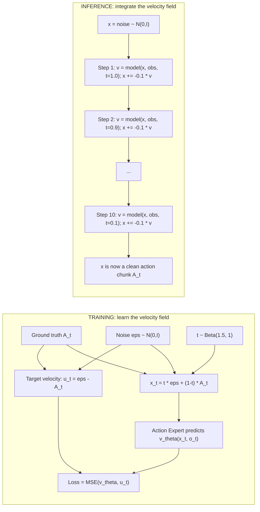
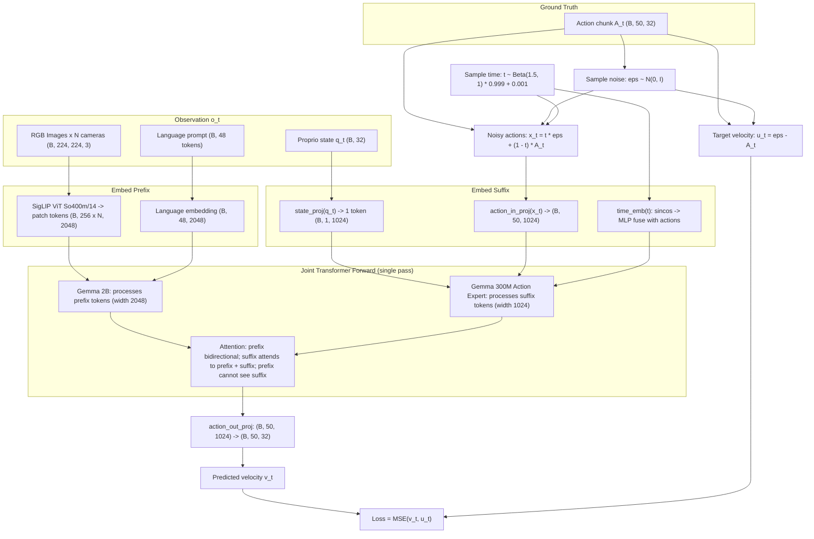
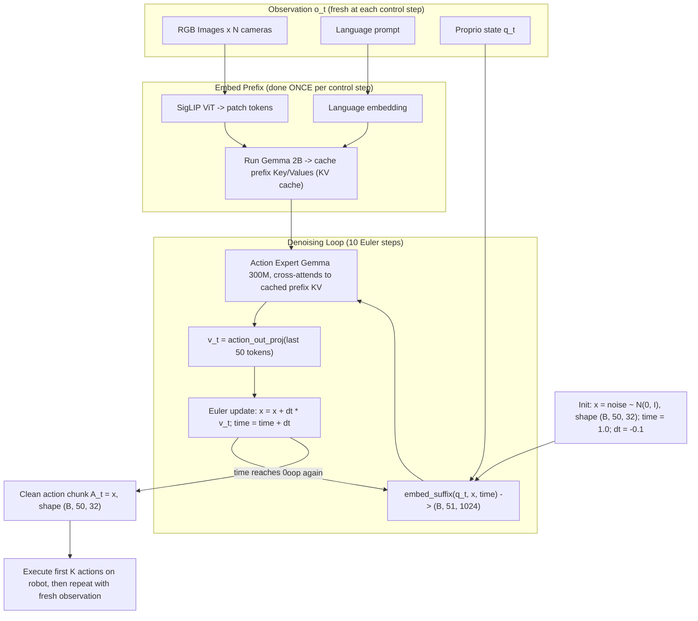

# π₀: Vision-Language-Action Flow Model for General Robot Control

**Paper:** [arXiv:2410.24164](https://arxiv.org/pdf/2410.24164)
**Code:** [github.com/Physical-Intelligence/openpi](https://github.com/Physical-Intelligence/openpi)

---

## 1. Architecture Overview

π₀ is a Vision-Language-Action (VLA) flow model built on a pre-trained VLM backbone (PaliGemma ~3B params), augmented with a separate **Action Expert** (~300M params) that generates continuous robot actions via **conditional flow matching**.

### Core Components

| Component | Model | Params | Role |
|-----------|-------|--------|------|
| Vision Encoder | SigLIP ViT (So400m/14) | ~400M | Encode RGB images into patch tokens |
| Language Model | Gemma 2B (decoder-only) | ~2B | Process language + vision tokens |
| Action Expert | Gemma 300M (decoder-only) | ~300M | Generate action vector field via flow matching |

Total: ~3.3B parameters.

### Inputs (Observation `o_t`)

| Input | Shape | Description |
|-------|-------|-------------|
| RGB Images | `[B, 224, 224, 3]` × N cameras | Typically 2–3 views (wrist, base, exterior) |
| Language prompt `ℓ_t` | `[B, max_token_len]` int32 | Tokenized text command (max 48 tokens for π₀) |
| Proprioceptive state `q_t` | `[B, action_dim]` float32 | Joint angles/configurations (zero-padded to 32D) |

### Output

| Output | Shape | Description |
|--------|-------|-------------|
| Action chunk `A_t` | `[B, 50, action_dim]` float32 | 50 future actions (H=50) for high-frequency control |

`action_dim = 32` (padded for the largest robots; masked for smaller ones).

---

## 2. Submodule Details and Dimensions

### SigLIP ViT Image Encoder

- **Architecture:** ViT-So400m/14, "none" pooling (returns all patch tokens)
- **Paper:** "Sigmoid Loss for Language-Image Pre-Training" (Zhai et al., Google 2023)
- **Innovation:** Uses sigmoid loss instead of softmax (CLIP), enabling better scalability
- **Input:** `[B, 224, 224, 3]` float32 (pixels in [-1, 1])
- **Output:** `[B, 256, 2048]` — 256 patch tokens (16×16 grid), each projected to Gemma width (2048)
- **Pre-trained on:** Web-scale image-text pairs with contrastive sigmoid loss
- **Processing:** Each camera image is encoded **independently** (shared weights), then tokens are concatenated

### Gemma 2B (VLM Backbone)

- **Architecture:** Decoder-only transformer
- **Config:** width=2048, depth=18, mlp_dim=16384, num_heads=8, head_dim=256
- **Features:** RoPE (rotary embeddings), GeGLU activations
- **Paper:** Google's Gemma (2024)
- **Pre-trained on:** Massive text data (as part of PaliGemma on image-text)

### Action Expert (Gemma 300M)

- **Architecture:** Decoder-only transformer (same style as Gemma, but smaller)
- **Config:** width=1024, depth=18, mlp_dim=4096, num_heads=8, head_dim=256
- **Initialized from scratch** (not pre-trained), trained with flow matching supervision
- **Key difference:** Uses **bidirectional attention** within action tokens + cross-attention to observation tokens

### Projection Layers

| Layer | Input → Output | Purpose |
|-------|----------------|---------|
| `action_in_proj` | `[B, 50, 32] → [B, 50, 1024]` | Project actions to expert width |
| `action_out_proj` | `[B, 50, 1024] → [B, 50, 32]` | Project expert output to action space |
| `state_proj` | `[B, 32] → [B, 1, 1024]` | Project proprioception to expert width |
| `action_time_mlp_in` | `[B, 50, 2048] → [B, 50, 1024]` | Fuse action + time embeddings |
| `action_time_mlp_out` | `[B, 50, 1024] → [B, 50, 1024]` | Refine fused tokens |

---

## 3. What is `q_t`?

`q_t` is the **proprioceptive state vector** — the robot's current joint angles/configurations at timestep t. It is:
- A continuous float vector of dimension `action_dim` (32)
- Projected via a linear layer (`state_proj`) into the action expert's embedding space (1024D)
- Fed as a single token in the "suffix" (action expert side)
- Zero-padded for robots with fewer joints

This gives the model awareness of the robot's current physical pose, essential for generating correct next actions.

---

## 4. The Attention Mask Design (Key Innovation)

The model uses a **prefix-suffix architecture** with carefully designed attention:

```
[prefix: image_tokens | language_tokens]  [suffix: state_token | action_tokens]
         ↕ bidirectional                              ↕ bidirectional
         
Prefix tokens: ar_mask = 0 (attend to each other freely)
Suffix tokens: First token ar_mask = 1 (breaks attention from prefix→suffix)
               Remaining action tokens: ar_mask = 0 (attend to each other bidirectionally)
```

**Effect:**
- Prefix (vision + language) tokens attend bidirectionally among themselves
- Suffix (state + actions) tokens attend bidirectionally among themselves AND to all prefix tokens
- Prefix tokens **cannot** attend to suffix tokens (causal boundary)

This means observations are processed independently of the noisy actions — enabling **KV cache reuse** during inference.

---

## 5. Flow Matching: Complete Explanation

### What is Flow Matching?

Flow matching is a generative modeling technique (Lipman et al., 2023) that learns a **vector field** to transport samples from a simple distribution (Gaussian noise) to a complex data distribution (real robot actions). Unlike diffusion models that learn a score function, flow matching directly learns the velocity of an ODE that transforms noise → data.

### The Core Idea in π₀

The Action Expert does **NOT** directly output clean actions. Instead:
1. It receives noisy action tokens + observations
2. It predicts a **velocity vector** (direction + magnitude to denoise)
3. During inference, this velocity is integrated over multiple steps to progressively denoise random noise into a realistic action chunk

### Mathematical Formulation

**Linear interpolation path** (between data and noise):
```
x_t = t × ε + (1 - t) × A_t
```
where:
- `t ∈ [0, 1]` is the flow timestep (t=0 → clean data, t=1 → pure noise)
- `A_t` is the ground-truth action chunk
- `ε ~ N(0, I)` is Gaussian noise

> **Note:** The openpi code uses the **opposite convention** from the paper:
> - Code: t=1 is noise, t=0 is clean (diffusion convention)
> - Paper: τ=0 is noise, τ=1 is clean
> 
> In code: `x_t = time * noise + (1 - time) * actions`

**Target velocity** (the "ground truth" for training):
```
u_t = ε - A_t    (= noise - actions in code)
```
This is the direction from data toward noise (or equivalently, negating it gives the denoising direction).

**Predicted velocity:**
```
v_θ(x_t, o_t) = ActionExpert(noisy_actions=x_t, observation=o_t, timestep=t)
```

**Loss function (Conditional Flow Matching):**
```
L(θ) = E[|| v_θ(x_t, o_t) - u_t ||²]
```
Simple MSE between predicted and target velocity, averaged over the action horizon.

### Flow Matching Process Diagram



### Time Sampling Distribution

The flow timestep `t` is sampled from `Beta(1.5, 1.0) × 0.999 + 0.001`:
- Beta(1.5, 1) is skewed toward higher values (noisier states)
- This emphasizes training on harder (noisier) denoising steps
- The 0.999/0.001 clamping avoids exact 0 or 1

---

## 6. Training Process (Step by Step)

```
For each training batch:

1. Load batch: (observation, ground_truth_actions)
   - observation: images [B,224,224,3]×N, language [B,48], state [B,32]
   - actions: [B, 50, 32]

2. Sample noise:    ε ~ N(0, I), shape [B, 50, 32]
3. Sample time:     t ~ Beta(1.5, 1.0) * 0.999 + 0.001, shape [B]

4. Create noisy actions:
   x_t = t[:, None, None] * ε + (1 - t[:, None, None]) * actions    → [B, 50, 32]

5. Compute target velocity:
   u_t = ε - actions    → [B, 50, 32]

6. Forward pass (single pass through entire network):
   a. Embed prefix: images → SigLIP ViT → patch tokens; language → embed
      → prefix_tokens [B, ~(256×N_cameras + 48), 2048]
   b. Embed suffix: state → state_proj; x_t → action_in_proj; t → sincos_embed
      → Fuse action + time via MLP → suffix_tokens [B, 51, 1024]
   c. Construct attention mask (prefix↔prefix bidirectional; suffix→prefix+suffix)
   d. Run full transformer (both Gemma 2B and Gemma 300M process their respective tokens)
   e. Extract last 50 tokens from suffix output → action_out_proj
      → v_t [B, 50, 32]

7. Compute loss:
   loss = mean(||v_t - u_t||²)    (MSE per action dimension, mean over batch/horizon)

8. Backpropagate and update (trainable params only; frozen params stay in bfloat16)
```

### Training Code Reference (from openpi)

```python
# In pi0.py:compute_loss()
noise = jax.random.normal(noise_rng, actions.shape)
time = jax.random.beta(time_rng, 1.5, 1, batch_shape) * 0.999 + 0.001
x_t = time_expanded * noise + (1 - time_expanded) * actions
u_t = noise - actions

# Single forward pass → predicted velocity v_t
v_t = self.action_out_proj(suffix_out[:, -self.action_horizon:])

# Loss: MSE between predicted and target velocity
return jnp.mean(jnp.square(v_t - u_t), axis=-1)
```

### Training Infrastructure
- Optimizer: Adam-style (via optax)
- Pre-trained weights loaded from PaliGemma checkpoint
- Frozen params (VLM) kept in bfloat16; trainable params (action expert + projections) in full precision
- EMA (Exponential Moving Average) of params optionally maintained
- Image augmentation during training (crop, rotate, color jitter for non-wrist cameras)

---

## 7. Inference Process (Step by Step)

```
At each robot control timestep:

1. Capture observation o_t:
   - RGB images from N cameras → [1, 224, 224, 3] × N
   - Language command → tokenized [1, 48]
   - Current joint state → [1, 32]

2. Encode prefix (ONCE):
   - Images through SigLIP ViT → patch tokens
   - Language through embedding
   - Run prefix through Gemma 2B → cache key/values (KV cache)

3. Initialize: x = noise ~ N(0, I), shape [1, 50, 32]
   Set time = 1.0, dt = -1/num_steps (typically -0.1 for 10 steps)

4. Flow integration loop (10 steps, Euler method):
   For step = 1 to 10:
     a. Embed suffix with current x and current time
     b. Run suffix through Action Expert (cross-attending to cached prefix KV)
     c. Get predicted velocity: v_t = action_out_proj(output[:, -50:])
     d. Euler update: x = x + dt × v_t
     e. time = time + dt

5. After 10 steps: x has been denoised from pure noise → clean action chunk
   Output: A_t = x, shape [1, 50, 32]

6. Execute first K actions on the robot, then repeat from step 1
   (receding horizon control)
```

### Why KV Caching Matters

The observation encoding (step 2) is **expensive** (SigLIP + full transformer pass). By caching the key/value projections of the prefix tokens, the 10 denoising steps only need to:
- Re-embed the suffix (cheap: linear projections + MLP)
- Run the suffix through the action expert with cross-attention to cached KV

This makes the 10-step integration fast enough for real-time control.

### Inference Code Reference

```python
# In pi0.py:sample_actions()
# Cache prefix KV
_, kv_cache = self.PaliGemma.llm([prefix_tokens, None], mask=..., positions=...)

# Integration loop
dt = -1.0 / num_steps  # e.g., -0.1
x_t = noise  # [B, 50, 32], starts as pure Gaussian

def step(carry):
    x_t, time = carry
    # Embed suffix with current noisy actions and time
    suffix_tokens, ... = self.embed_suffix(observation, x_t, time)
    # Forward through action expert (uses cached prefix KV)
    (_, suffix_out), _ = self.PaliGemma.llm([None, suffix_tokens], kv_cache=kv_cache, ...)
    # Predict velocity and do Euler step
    v_t = self.action_out_proj(suffix_out[:, -50:])
    return x_t + dt * v_t, time + dt

# Run while time >= 0 (from 1.0 down to ~0.0)
x_0, _ = jax.lax.while_loop(cond, step, (noise, 1.0))
return x_0  # Clean action chunk
```

---

## 8. Flow Matching vs Other Approaches

| Aspect | Flow Matching (π₀) | Diffusion (DDPM) | Autoregressive (RT-2) |
|--------|--------------------|--------------------|----------------------|
| Output type | Continuous vectors | Continuous vectors | Discrete tokens |
| What's learned | Velocity field v_θ | Score ∇log p | Next-token logits |
| Inference | ODE integration (10 steps) | SDE/ODE (many steps) | Sequential token generation |
| Backbone | Transformer (action expert) | U-Net (typical) | Transformer |
| Precision | High (continuous) | High (continuous) | Limited by discretization |
| Speed | Fast (10 steps + KV cache) | Slow (50-1000 steps) | Slow (sequential) |

**Why flow matching for robotics?**
- Multimodal distribution support (multiple valid grasps)
- Continuous outputs (no discretization artifacts)
- Fast inference (only 10 ODE steps needed)
- Naturally handles high-dimensional action chunks (50×32 = 1600D)

---

## 9. Full Architecture Diagram

### Training Time



### Inference Time



---

## 10. Timestep Embedding Detail

The flow timestep `t` is encoded via sinusoidal positional embedding:

```python
# Parameters: dim=1024, min_period=4e-3, max_period=4.0
fraction = linspace(0, 1, dim//2)           # [512]
period = 0.004 * (4.0/0.004)^fraction       # log-spaced periods
sinusoid_input = t / period * 2π            # [B, 512]
time_emb = concat([sin(input), cos(input)]) # [B, 1024]
```

In π₀ (non-pi05): time_emb is tiled across all 50 action positions, concatenated with action embeddings ([B, 50, 2048]), then passed through a 2-layer MLP with SiLU activation to produce fused tokens [B, 50, 1024].

---

## 11. Inference Timing and Control

- **Action chunk:** H=50 steps generated at once
- **Control frequency:** Up to 50 Hz for dexterous tasks
- **Denoising steps:** 10 (forward Euler integration)
- **Hardware:** RTX 4090 with 3 cameras — fast enough for real-time
- **Receding horizon:** Execute first few actions, then re-plan with fresh observation

---

## 12. Data and Sim-to-Real

- **Training data:** 10,000+ hours of real robot data across multiple embodiments + open datasets (OXE, DROID)
- **No heavy sim-to-real:** Primarily trained on real-world data
- **Sensors:** Vision (RGB cameras) + proprioception only. No tactile/force sensors
- **Generalization:** Cross-embodiment pre-training + fine-tuning enables zero-shot transfer to new tasks
- **Contact-rich tasks:** Handles folding, grasping delicate objects via learned visual dynamics

---

## 13. Key Innovations

1. **Flow matching for actions** — Replaces discrete tokenization (RT-2) with continuous flow matching, enabling precise high-dimensional control
2. **Prefix-suffix architecture with KV caching** — Amortizes expensive vision/language encoding across denoising steps
3. **Separate Action Expert** — Lightweight transformer (300M) dedicated to robotics, avoiding contamination of the pre-trained VLM weights
4. **Action chunking (H=50)** — Generates smooth, temporally coherent trajectories instead of single-step actions
5. **Cross-embodiment training** — Single model handles diverse robots via zero-padded action spaces

---

## 14. Code Reference Map

| Concept | File (openpi) |
|---------|---------------|
| Model architecture (JAX) | `src/openpi/models/pi0.py` |
| Model architecture (PyTorch) | `src/openpi/models_pytorch/pi0_pytorch.py` |
| Config & dimensions | `src/openpi/models/pi0_config.py` |
| Gemma transformer | `src/openpi/models/gemma.py` |
| SigLIP encoder | `src/openpi/models/siglip.py` |
| Training loop | `scripts/train.py` |
| Policy (inference wrapper) | `src/openpi/policies/policy.py` |
| Base model interface | `src/openpi/models/model.py` |
