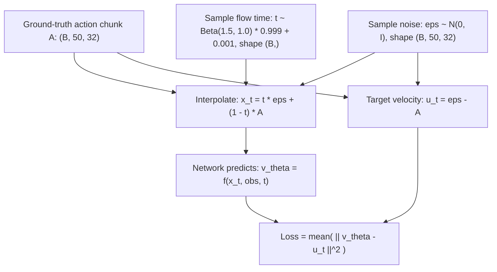
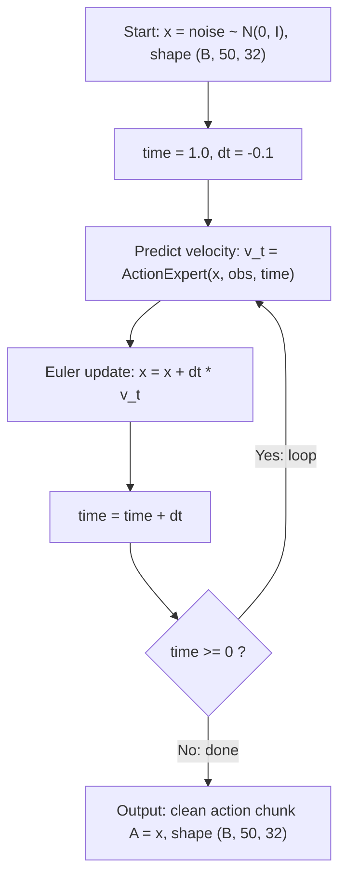

# Flow Matching in π₀

This document explains **only** the flow matching component used in π₀ — how it's trained and how it generates actions at inference time.

---

## What Flow Matching Does Here

Flow matching learns a **velocity field** that transports samples from Gaussian noise to the distribution of real robot actions. Think of it as learning "which direction to push" at every point in a noisy action space, conditioned on what the robot sees.

---

## Inputs and Outputs

### Training

| | Shape | Description |
|---|---|---|
| **Input: ground-truth actions** | `(B, 50, 32)` | Real action chunk from dataset |
| **Input: observation features** | `(B, S, D)` | Already-encoded vision + language + state (from upstream network) |
| **Output: loss scalar** | `()` | MSE between predicted and target velocity |

### Inference

| | Shape | Description |
|---|---|---|
| **Input: observation features** | `(B, S, D)` | Encoded vision + language + state |
| **Input: random noise** | `(B, 50, 32)` | Starting point, sampled from N(0, I) |
| **Output: action chunk** | `(B, 50, 32)` | Denoised clean actions (50 timesteps × 32 action dims) |

---

## Training Process



### Step by step

1. **Sample noise** `ε ~ N(0, I)` with same shape as the action chunk `(B, 50, 32)`

2. **Sample a flow timestep** `t` from `Beta(1.5, 1.0) * 0.999 + 0.001`
   - `t` is per-sample, shape `(B,)`
   - Skewed toward 1.0 (noisier), so the model trains harder on denoising
   - Clamped away from exact 0 or 1

3. **Create noisy actions** via linear interpolation:
   ```
   x_t = t * ε + (1 - t) * A
   ```
   - When t=1: x_t ≈ pure noise
   - When t=0: x_t ≈ clean actions
   - In between: a blend

4. **Compute target velocity** (the "correct answer"):
   ```
   u_t = ε - A
   ```
   This is the constant velocity along the straight-line path from clean actions (t=0) to noise (t=1).

5. **Network predicts velocity** given the noisy actions, observations, and timestep:
   ```
   v_θ = ActionExpert(x_t, observation_features, t)
   ```

6. **Loss** — simple MSE:
   ```
   L = mean( || v_θ - u_t ||² )
   ```
   Averaged over batch, action horizon (50), and action dimensions (32).

### Code (from openpi `pi0.py:compute_loss`)

```python
noise = jax.random.normal(noise_rng, actions.shape)          # (B, 50, 32)
time = jax.random.beta(time_rng, 1.5, 1, batch_shape) * 0.999 + 0.001  # (B,)

time_expanded = time[..., None, None]                        # (B, 1, 1)
x_t = time_expanded * noise + (1 - time_expanded) * actions  # (B, 50, 32)
u_t = noise - actions                                         # (B, 50, 32)

# ... forward pass produces v_t from (x_t, observation, time) ...
v_t = self.action_out_proj(suffix_out[:, -self.action_horizon:])  # (B, 50, 32)

loss = jnp.mean(jnp.square(v_t - u_t), axis=-1)             # (B, 50)
```

---

## Inference Process



### Step by step

1. **Start with pure noise**: `x = ε ~ N(0, I)`, shape `(B, 50, 32)`

2. **Set time = 1.0** (fully noisy) and **dt = -1/num_steps = -0.1** (10 steps)

3. **Loop 10 times** (time goes 1.0 → 0.9 → 0.8 → ... → 0.1 → 0.0):
   - Feed current `x` + observations + current `time` into the network
   - Network outputs predicted velocity `v_t`, shape `(B, 50, 32)`
   - Euler step: `x = x + dt * v_t` (move x toward clean actions)
   - Advance time: `time = time + dt`

4. **After 10 steps**: `x` has been transported from noise to the data distribution.
   Output is the **denoised action chunk** `(B, 50, 32)`.

### Code (from openpi `pi0.py:sample_actions`)

```python
dt = -1.0 / num_steps  # -0.1 for 10 steps
noise = jax.random.normal(rng, (batch_size, 50, 32))

# Loop: time starts at 1.0, decreases by 0.1 each step
def step(carry):
    x_t, time = carry
    # predict velocity from current noisy actions
    v_t = forward(x_t, observation, time)  # (B, 50, 32)
    # Euler integration step
    return x_t + dt * v_t, time + dt

x_0, _ = jax.lax.while_loop(
    lambda carry: carry[1] >= -dt / 2,  # while time >= ~0
    step,
    (noise, 1.0)
)
return x_0  # clean action chunk
```

---

## Intuition

```
t=1.0 (pure noise)          t=0.5 (halfway)           t=0.0 (clean actions)
     ε ~ N(0,I)       -->   blurry actions      -->    realistic A_t
         ·  · ·                  ~~~                    ─────────
       · · ·  ·               ~~  ~~                   smooth trajectory
         · ·                    ~~~                    ─────────

     The velocity field v_θ tells us which direction to move at each point.
     10 small Euler steps follow this field from noise to data.
```

- At t=1.0: the model sees near-random noise and gives a big push toward the rough action shape
- At t=0.5: the model refines the coarse shape into something plausible
- At t=0.1: the model makes final precise adjustments

---

## Why This Design?

| Property | Benefit for robotics |
|----------|---------------------|
| **Continuous output** | No discretization artifacts — smooth joint trajectories |
| **Multimodal** | Can represent multiple valid action modes (e.g., grasp from left or right) |
| **Only 10 steps** | Fast enough for real-time control (vs 50-1000 steps in DDPM) |
| **Straight-line paths** | Simpler than curved diffusion paths — easier to learn, fewer steps needed |
| **Chunk generation** | Produces 50 temporally-coherent actions at once — smooth high-frequency control |

---

## Key Differences from Standard Diffusion

| | Flow Matching (π₀) | DDPM Diffusion |
|---|---|---|
| Path from noise → data | Straight line | Curved (VP/VE SDE) |
| What's learned | Velocity field v_θ | Score function ∇log p_t |
| Training target | `u_t = ε - A` (constant per sample) | Time-dependent score |
| Inference ODE | `dx/dt = v_θ(x, t)` | Probability flow ODE |
| Steps needed | ~10 | ~50-1000 |
| Network | Transformer (action expert) | Typically U-Net |
